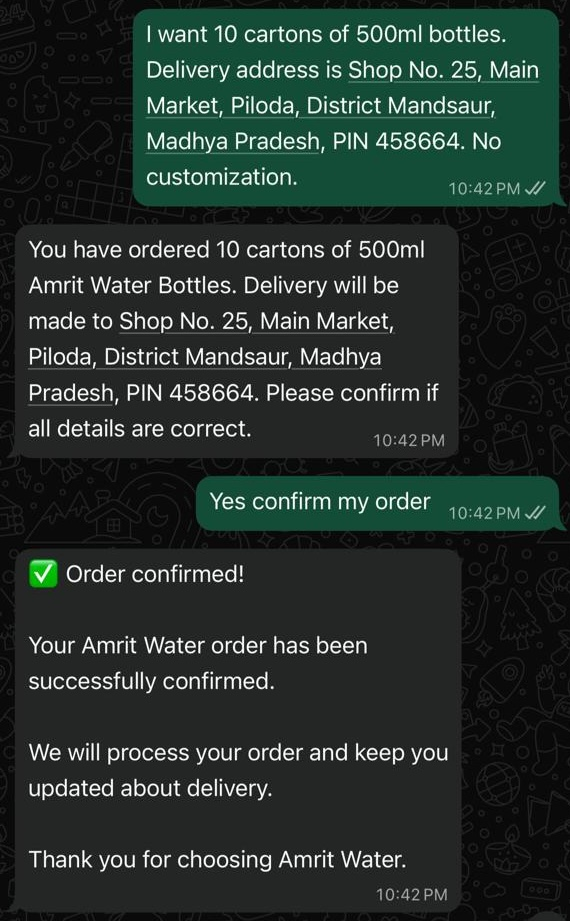

# Amrit Water — WhatsApp AI Sales & Order Assistant

> AI-powered conversational sales and order automation solution designed for a wholesale packaged-water business.

## Project Overview

Amrit Water is a wholesale packaged-water business that receives customer orders and inquiries through WhatsApp.

This project transforms a manual WhatsApp ordering process into a structured AI-assisted workflow that can:

- Receive customer messages through WhatsApp
- Understand natural-language order requests
- Extract structured order information
- Apply predefined business rules
- Store order information
- Request customer confirmation
- Update order status after confirmation
- Respond to customers through WhatsApp

This project demonstrates an AI Solutions Consulting approach combining business requirements, solution architecture, conversational AI, workflow automation, API integration, and controlled AI usage.

## Business Problem

Manual WhatsApp ordering requires staff to repeatedly read customer messages, identify product and quantity, capture delivery information, clarify details, record orders, and confirm them with customers.

The objective was to create a structured conversational workflow that reduces manual order-processing effort while keeping business rules and customer confirmation under explicit control.

## Solution

The solution uses:

**WhatsApp Cloud API → n8n → OpenAI → Structured Order Data → Business Rules → Order Confirmation**

### High-Level Workflow

```text
Customer
   ↓
WhatsApp Cloud API
   ↓
n8n Webhook
   ↓
Message Processing
   ↓
AI Order Extraction
   ↓
Structured Order Data
   ↓
Business Rules & Validation
   ↓
Order Persistence
   ↓
Customer Confirmation
   ↓
Confirmed Order
```

## Technology Stack

| Technology | Purpose |
|---|---|
| Meta WhatsApp Cloud API | Customer messaging channel |
| n8n | Workflow orchestration and automation |
| OpenAI GPT-4.1-mini | Natural-language understanding and structured extraction |
| n8n Data Tables | Order data persistence |
| Webhooks | Event-driven message processing |

Key Workflow Components

1. WhatsApp Webhook

Receives incoming WhatsApp events and handles webhook verification.

2. Message Processing

Extracts relevant information from incoming customer messages, including the customer number, message text, and message ID.

3. AI Order Extraction

The AI analyzes the customer’s message and extracts structured information such as:

* Order intent
* Bottle size
* Quantity
* Delivery location
* Customization requirement
* Confirmation intent

4. Business Rules

The workflow applies predefined business rules instead of relying entirely on free-form AI responses.

Current rules include:

* Orders are handled in cartons
* 1 carton = 12 bottles
* Current workflow configuration supports 500ml bottles
* Exact bottle quantities can be converted into cartons
* Customer confirmation is required before an order becomes confirmed

5. Order Persistence

Order information is stored with fields including:

* Phone number
* Bottle size
* Quantity in cartons
* Delivery location
* Customization
* Order status

6. Customer Confirmation

New orders enter a pending-confirmation state.

The customer receives an order summary and explicitly confirms the order before it is marked as confirmed.

AI Design Approach

The AI is primarily responsible for language understanding and structured extraction.

The workflow remains responsible for:

* Business rules
* Data persistence
* Order status
* Confirmation handling
* WhatsApp communication

This separation creates a more controlled AI automation architecture instead of allowing the LLM to make unrestricted business decisions.
solution architecture
WhatsApp Demonstration

The following example shows the conversational order flow:

Customer order → AI-generated order summary → Customer confirmation → Confirmed order
### Live WhatsApp Order Flow

The following screenshot demonstrates the end-to-end customer order and confirmation flow.


My Role — AI Solutions Consultant

This project was developed as an independent AI Solutions Consulting portfolio case study.

My responsibilities included:

* Translating a real-world business process into an AI automation use case
* Defining business requirements
* Designing the solution architecture
* Designing the AI extraction and structured-output approach
* Defining business rules and validation logic
* Designing the order confirmation workflow
* Implementing the workflow using n8n
* Integrating WhatsApp Cloud API
* Designing the order data structure
* Testing conversational order scenarios
* Preparing business and technical documentation

The focus was on problem framing, solution architecture, AI workflow design, responsible AI usage, and business-process automation.

Project Documentation
- [Business Requirements Document (BRD)](docs/Amrit%20-water-BRD.pdf)
- - [Solution Design Document](docs/Amrit-water-solution-design.pdf)
  - - [Sanitized n8n Workflow](workflow/amrit-water-whatsapp-ai-assistant.json)  - 


The workflow shared in  repository is sanitized for portfolio use. Credentials, access tokens, and account-specific sensitive configuration have been removed.

Security

No production access tokens, API keys, passwords, or active credentials are included in this repository.

Credentials must be configured separately when deploying the workflow.

Future Enhancements

Potential future iterations include:

* Persistent conversational order state
* Order modification and cancellation flows
* Automated delivery-status updates
* Product catalogue integration
* Customer/order history
* Human-agent escalation
* CRM/ERP integration
* Analytics and reporting
repository structure
Project-4-Amrit-Water-WhatsApp-AI-Assistant/
├── docs/
├── screenshots/
├── workflow/
└── README.md

Project Takeaway

This project demonstrates how an AI Solutions Consultant can combine business requirements, conversational AI, deterministic business logic, workflow automation, API integration, and structured data to design a practical AI-enabled business solution.

